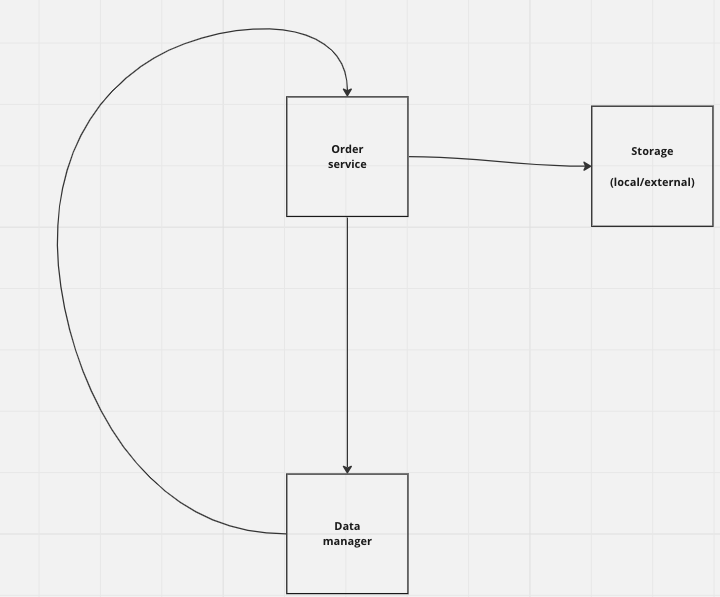

# HW8 &ndash; GRPC, Databases

---

## Сервис заказов.

В прошлом домашнем задании вы познакомились с конкурентными паттернами. Пришло время соединить эти знания с текущей темой, создав свой сервис заказов, хоть и с очень упрощенной логикой. Это домашнее задание является логическим продолжением предыдущего, вы не сможете выполнить его без предыдущего, данное условие было заранее оговорено на лекциях


Всего у вас будет два сервиса - data-manager и order-service. Они будут работать по следующей схеме:



Предполагается следующий сценарий использования. Запрос с заказами для обработки приходит в order-service, после чего он запускает их обработку с помощью написанного вами в прошлом домашнем задании воркерпула.

После чего, на одной из стадий пайплайна, а именно на стадии `StartedToExternalInteractionAction`, вам необходимо сделать запрос в data-manager для получения `StorageID` и `PickupPointID`.

Но не все так просто, data-manager отдаст вам данные не в ответе на запрос, а пришлет коллбек с нужной информацией.

Вам нужно корректно обработать запросы в order-service, гарантируется, что `OrderID` не совпадают, а также могут быть отрицательными.

### Начнем с сервиса под названием data-manager.
`/data_manager/internal/api/proto/data_manager.proto`

Данный сервис отвечает за предоставление нужных данных для заказа. Он полностью написан нами, вы можете использовать его, чтобы посмотреть основные концепции. Запрещается менять что-либо, кроме директории order_service.

### Давайте перейдем к основной части, а именно к order-service.
Ваша задача реализовать API, описанное в файле
`/order_service/internal/api/proto/order_service.proto`

```protobuf
// Обработка заказов
rpc ProcessOrders(ProcessOrdersRequest) returns (ProcessOrdersResponse) {}

// Коллбек от data-manager
rpc SendOrderDataCallback(SendOrderDataCallbackRequest) returns (google.protobuf.Empty) {}
```

Для реализации вам также понадобится сгенерировать клиента к data-manager
`/order_service/internal/clients/proto/data_manager.proto`

Вы можете менять order-service так, как захотите. Главное условие, чтобы у вас исправно работал `make build`. Для вашего удобства мы создали следующие скрипты:

* `init-repo.sh` - скрипт для установки некоторых зависимостей
* `local-test-script.sh` - скрипт для запуска тестов локально
* `run-without-docker.sh` - скрипт для запуска сервисов локально
* `run-with-docker.sh` - скрипт для запуска сервисов в Docker

Также, обратите внимание на `Makefile`, который мы создали в каждом сервисе. В нем есть все, чтобы собрать ваш проект. Можете проверить его работу в директории `data_manager`:

```sh
make build
```

### Бонусное задание
Некоторые заказы могут не обработаться с первого раза, например, из-за сетевых проблем. Вам необходимо поднять базу данных, в которую вы будете складывать заказы, которые необходимо отправить на обработку повторно в рамках одного запроса. У вас получится своеобразная очередь. Тесты на это задание будут выложены позже или не будут выложены вообще.

### Запрещается в задании:
* Менять тесты курса
---

### Примечания:
* Обратите внимание, что ваш order-service должен запускаться на определенном порту, который передан в аргументах запуска (там так же будет адрес сервиса data-manager).
---

## Как сдавать:
* Проверить, что появился **ваш личный** репозиторий с `HW8`, сделать его клон,
  личный репозиторий имеет вид `https://tinkoff-edu.gitlab.yandexcloud.net/itmo-course-autumn-2023/Students/<username>/Homeworks/HW8`
* Добавить ваше решение в ветку `hw`
* Добавить файл конфигурации `.gitlab-ci.yml` для запуска пайплайна с тестами
* Открыть _Merge request_ из ветки `hw` в ветку `master` **вашего репозитория** (не основного)
* Дождаться, когда пайплайн станет зелёным
* Если будут вопросы по времени сдачи дз &mdash; мы будем ориентироваться на время последнего вашего действия в _Merge request_.
